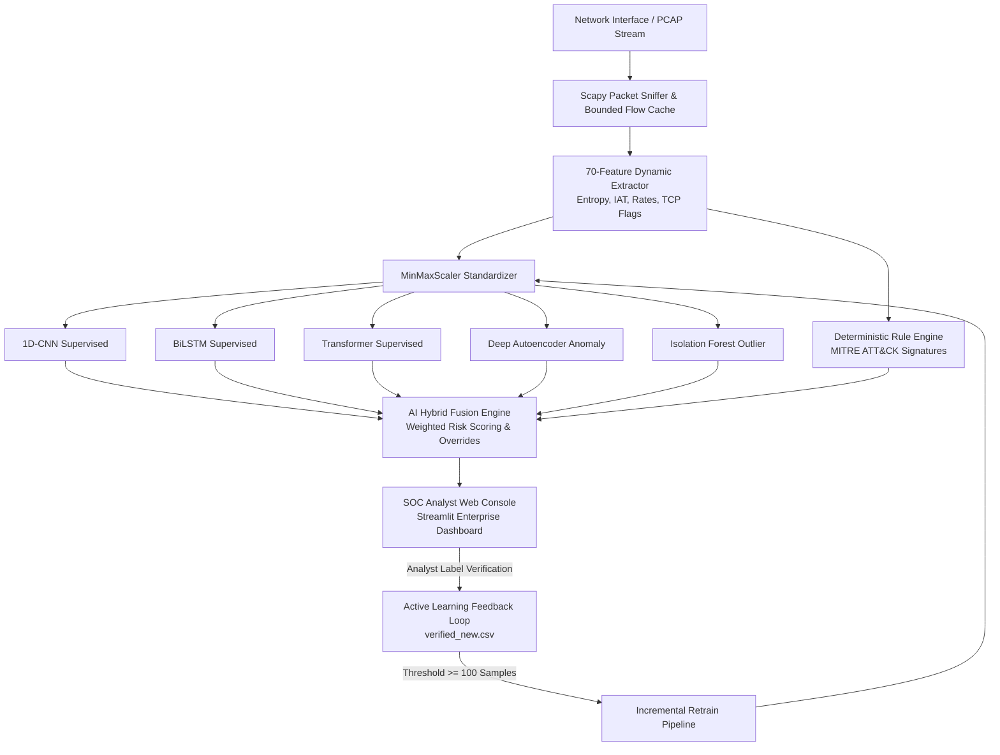

# 🛡️ AI-BASED NIDS — Hybrid Network Intrusion Detection System

[](https://www.python.org/)
[](https://www.tensorflow.org/)
[](https://streamlit.io/)
[](https://scapy.net/)
[](https://attack.mitre.org/)
[](LICENSE)

An enterprise-grade **Hybrid Network Intrusion Detection System (NIDS)** combining **Supervised Deep Learning**, **Unsupervised Zero-Day Anomaly Detection**, and **Deterministic Rule Matching** mapped to the MITRE ATT&CK framework. Built with real-time packet sniffing, flow feature extraction, active learning feedback loops, and an interactive SOC Analyst Web Dashboard.

---

## 📐 System Architecture



---

## ✨ Key Capabilities

| Capability | Technical Implementation | Security Impact |
|---|---|---|
| **Multi-Model Ensemble** | 1D-CNN + BiLSTM + Transformer | High precision classification on known attack signatures (>99% accuracy) |
| **Zero-Day Defense** | Deep Autoencoder & Isolation Forest | Flags novel zero-day threats via reconstruction MSE deviations |
| **Deterministic Overrides** | Hard signature checks with MITRE tagging | Eliminates false negatives on critical scans (SYN Floods, Xmas Scans) |
| **Gold-Standard Pipeline** | 70-feature aligned extraction (CIC-IDS standard) | Consistent tabular alignment between live packets and training benchmarks |
| **Active Learning Loop** | SOC analyst verification feedback logging | Automatically adapts to evolving traffic patterns via incremental fine-tuning |
| **Enterprise SOC Console** | Clean, dark-themed Streamlit interface | Incident triage, PCAP inspection, drilldowns, and attack simulation |

---

## ⚡ Quick Start

### 1. Prerequisites & Environment Setup

```bash
# Clone the repository
git clone https://github.com/TUSHAR91316/AI-BASED-NIDS.git
cd AI-BASED-NIDS

# Create and activate virtual environment
python -m venv venv
# On Windows:
venv\Scripts\activate
# On Linux/macOS:
source venv/bin/activate

# Install dependencies
pip install -r requirements.txt
```

> **Windows Note**: Scapy live packet sniffing requires [Npcap](https://npcap.com/) installed with *WinPcap API-compatible mode* enabled.

### 2. Launch the SOC Dashboard

```bash
streamlit run dashboard/app.py
```
Open **`http://localhost:8501`** in your browser.

---

## 🖥️ Dashboard Features

The dashboard provides an enterprise SOC interface across 5 core modules:

1. **Overview & Triage**:
   - Real-time KPI metrics (Total Monitored Flows, Critical/High Threats, Suspicious Flows, Origin IPs).
   - Incident severity bar charts and attack source distribution donut charts.
   - Live incident feed with automated executive threat briefing summaries.

2. **PCAP Traffic Analysis**:
   - Drag-and-drop `.pcap` / `.pcapng` file ingestion with progress tracking.
   - Batch packet processing and flow feature extraction.

3. **Threat Investigation & Logs**:
   - Filterable event tables with IP search and date-range pickers.
   - Individual model score contributions bar chart (`CNN`, `BiLSTM`, `Transformer`, `Autoencoder`, `Isolation Forest`).
   - One-click CSV and JSON report exports.

4. **SOC Feedback Loop (Active Learning)**:
   - Validate alerts as **True Positive (Attack)** or **False Positive (Benign)**.
   - Live progress indicator tracking samples toward the automated 100-sample retraining trigger.

5. **Attack Traffic Simulator**:
   - Inject simulated attack flows (`SYN Port Scan`, `Volumetric DoS Flood`, `Xmas Stealth Scan`) for instant pipeline testing.

---

## 🧠 Model Training

### Option A: Free Google Colab GPU Training (Recommended)

Train all 5 neural network models in the cloud on a free T4 GPU:

1. Open [`AI_NIDS_Colab_Training.ipynb`](AI_NIDS_Colab_Training.ipynb) in [Google Colab](https://colab.research.google.com).
2. Set hardware accelerator to **T4 GPU** (`Runtime → Change runtime type → T4 GPU`).
3. Enter your Kaggle API key credentials in Cell 2.
4. Select `Runtime → Run All`.
5. Download `NIDS_Models.zip` upon completion, extract to the project root directory, and launch the dashboard.

### Option B: Local Training Pipeline

```bash
# 1. Download benchmark datasets (CIC-IDS2017, CSE-CIC-IDS2018, etc.)
python data_pipeline/dataset_manager.py --essential

# 2. Execute local multi-model training pipeline
python models/train_local.py
```

### Model Artifact Structure

```
models/
├── cnn_model.h5                            # 1D-CNN Supervised Classifier
├── scaler.joblib                           # Fitted 70-feature MinMaxScaler
├── autoencoder/
│   ├── autoencoder.h5                      # Reconstruction Autoencoder
│   └── threshold.txt                       # 99th percentile anomaly threshold
├── lstm/
│   └── lstm_model.h5                       # Bidirectional LSTM Model
├── transformer/
│   └── transformer_model.h5                # Tabular Transformer Model
└── isolation_forest/
    └── isolation_forest.joblib             # Unsupervised Isolation Forest
```

---

## 📊 Dataset Benchmark Support

| Dataset | Attack Types Covered | Primary Use Case |
|---|---|---|
| **CIC-IDS2017** | 14 attack categories (DoS, PortScan, Botnet, Web Attacks) | Primary benchmark & baseline training |
| **CSE-CIC-IDS2018** | Large-scale multi-day infrastructure attacks | High-volume stress testing & validation |
| **CIC-IoT-2023** | 33 IoT device attacks across 100+ scenarios | IoT/Edge perimeter intrusion defense |
| **NSL-KDD** | Normalized classic network attack distribution | Cross-benchmark sanity validation |

---

## 📁 Repository Layout

```
AI-BASED-NIDS/
├── realtime_detector/            # Real-time packet sniffing and flow engine
│   └── detector.py               # Scapy sniffer, parallel inference, async logger
├── feature_extractor/            # 70-feature statistical extraction
│   └── flow_features.py          # Numba-optimized Shannon Entropy, IAT, flag rates
├── fusion_engine/                # Hybrid decision & active learning logic
│   ├── fusion.py                 # Risk score calculation & deterministic overrides
│   ├── rule_engine.py            # Rule matching with MITRE ATT&CK tactic tags
│   └── feedback_loop.py          # Ground truth logging & retrain trigger
├── data_pipeline/                # Dataset management & standardization
│   ├── loader.py                 # FeatureAligner & chunked CSV loaders
│   └── dataset_manager.py        # Automated multi-dataset downloader
├── models/                       # Machine Learning architectures
│   ├── train_local.py            # Local multi-dataset training script
│   └── retrain_pipeline.py       # Active learning fine-tuning pipeline
├── dashboard/                    # SOC Analyst Web Application
│   ├── app.py                    # Streamlit enterprise SOC dashboard
│   ├── llm_summarizer.py         # Threat intelligence briefing summarizer
│   └── alerts.json               # Alert buffer log
├── AI_NIDS_Colab_Training.ipynb  # End-to-end Google Colab GPU training notebook
├── generate_colab_notebook.py    # Automated notebook generator
├── simulate_attack.py            # Raw Scapy attack packet injector
└── requirements.txt              # Core Python dependencies
```

---

## 🔒 Security & Contribution

Contributions and pull requests are welcome. Please ensure that all feature extraction rules maintain alignment with the **70-feature standard** in [`data_pipeline/loader.py`](data_pipeline/loader.py).

---

## 📜 License

This project is licensed under the [MIT License](LICENSE).
